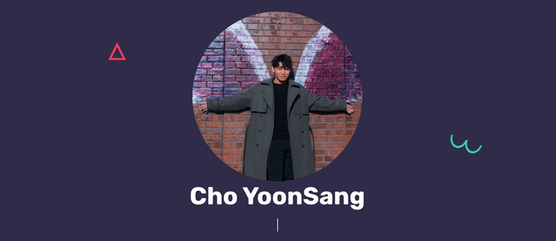

# YoonSang Cho (Maitan21)
I’m Yoonsang Cho, working as a developer and a consultant in Republic of Korea.

I have done a lot of experiences in regards to development, building, and customization. I’m willing to pursue various challenges. I confidently face challenges and solve without hesitation.
I’m always looking for new, exciting experiences.👋💕

## My values
🌟 Expression as authentic self 
💖 Safety and trust 
🍏 Beginner's mindset and curiosity 
🙌 Shared understanding and consensus
🌱 I’m currently learning Cloud (AWS, Azure)

## How I work
My motivations are to stabilize and provide clarity through curiosity. That tends to manifest as creating (hopefully) just enough process. Checklists are my absolute favorite. ✅ If I'm too much in my head, feel free to nudge me to share what's in my brain. 😸

## Get in touch
- Portfolio : https://maitan21.github.io/Portfolio/  
- Personal site: http://emongfactory.tistory.com/
- Instagram : https://www.instagram.com/j.y.s_94/

<!--

Here are some ideas to get you started:

- 🔭 I’m currently working on ...
- 🌱 I’m currently learning ...
- 👯 I’m looking to collaborate on ...
- 🤔 I’m looking for help with ...
- 💬 Ask me about ...
- 📫 How to reach me: ...
- 😄 Pronouns: ...
- ⚡ Fun fact: ...
-->
